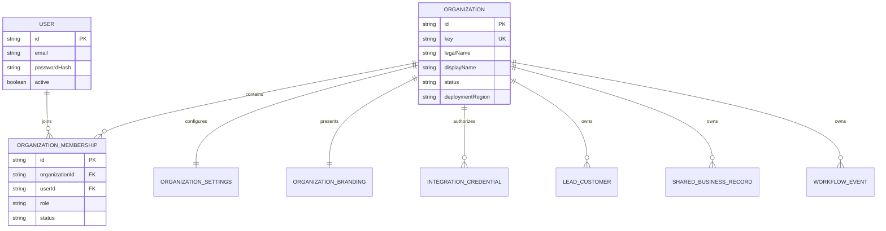

# eCRM Multitenancy and Productization Architecture

**Status:** Approved target design  
**Date:** 2026-08-09  
**Scope:** Convert eCRM from an ARA Global single-company application into an independently sellable enterprise CRM

## 1. Decision

Add a native `Organization` tenant model before onboarding the first external customer. The current absence of customer data makes this the least disruptive point to establish tenant identity and organization-scoped constraints.

The same application semantics support:

- pooled SaaS, with many organizations in a shared application and database; and
- dedicated enterprise cells, with one organization in a dedicated database or deployment.

Dedicated cells use the same schema and build artifact. They are not customer-specific forks.

## 2. Current-state constraints

The existing design and schema assume one company:

- `docs/superpowers/specs/2026-06-15-ecrm-design.md` explicitly excludes multitenancy;
- `User.email` is globally unique and user sessions contain no organization context;
- business tables have no tenant foreign key;
- `BusinessSettings.id` is a singleton default;
- `Branch.country` defaults to India;
- `SharedBusinessRecord` uniqueness is global;
- shared-record and workflow-event APIs use a single environment token;
- the login page and theme tests embed ARA Global.

Adding a cosmetic company-name setting is insufficient. Tenant identity must be present in authorization, database constraints, queries, jobs, exports, storage keys, audit, and integration credentials.

## 3. Target domain model



### 3.1 Organization

Required fields:

- immutable UUID/CUID `id`;
- stable unique `key` used for provisioning and integration mapping;
- legal and display names;
- lifecycle status: `PROVISIONING`, `ACTIVE`, `SUSPENDED`, `OFFBOARDING`, `DELETED`;
- deployment/data region;
- timestamps and optimistic version.

Names and slugs are not authorization boundaries.

### 3.2 Membership and roles

Replace the direct global role assumption with organization membership:

```text
OrganizationRole = OWNER | ADMIN | SALES | FINANCE | PRODUCTION | READ_ONLY
MembershipStatus = INVITED | ACTIVE | SUSPENDED | REVOKED
```

Keep `User.active` as platform-account state during migration. Organization authorization is derived from an active membership, not `User.role`.

For the first phase, one user may belong to multiple organizations but has one active organization per session. Support personnel require a separate, time-bound impersonation/support-access mechanism; they must not receive hidden global access through normal roles.

### 3.3 Organization settings and branding

`OrganizationSettings` replaces singleton business defaults and includes:

- currency, locale, timezone, default country;
- tax and invoice configuration references;
- payment cycles and numbering rules;
- retention and financial close rules;
- enabled modules and operational limits.

`OrganizationBranding` includes:

- display/product name;
- logo and image asset IDs;
- primary/secondary colors;
- support and legal links;
- email and document identity.

Missing branding renders neutral eCRM branding, never ARA Global.

## 4. Tenant ownership across the schema

Every root or externally addressable record receives a non-null `organizationId`. Child records also receive it where doing so improves RLS, query safety, export, or partitioning; relations enforce that parent and child belong to the same organization.

| Domain | Tables requiring direct organization ownership |
|---|---|
| Identity/configuration | `OrganizationMembership`, `OrganizationSettings`, `OrganizationBranding`, integration credentials |
| Shared integration | `SharedBusinessRecord`, versions, export snapshots/items, `WorkflowEvent` |
| CRM | `LeadCustomer`, `Branch`, `Contact`, `Activity`, `LeadOwnershipHistory` |
| Sales workspace | `SalesTask`, text/voice notes and actions, day reviews/items |
| Pipeline | `PipelineStage`, `Opportunity`, owner splits, `SalesTarget` |
| Catalog/proposal | `ProductService`, `Proposal`, line items, PDF attachments |
| Order/production | `Order`, line/split snapshots, templates/stages, work items, stage instances, notes |
| Finance/incentive | `Invoice`, `Payment`, allocations, costs, incentives and splits |

### 4.1 Organization-scoped constraints

All business uniqueness must include `organizationId` unless the identifier is intentionally platform-global. Examples:

```prisma
@@unique([organizationId, email])
@@unique([organizationId, entityType, externalKey])
@@unique([organizationId, code])
@@unique([organizationId, proposalNumber])
@@unique([organizationId, orderNumber])
@@unique([organizationId, invoiceNumber])
```

Composite relations or application validation must prevent a child in organization A from referencing a parent in organization B.

## 5. Request and session context

The server derives active organization from a signed session that has been verified against current membership state.

```ts
type OrganizationSession = {
  userId: string;
  organizationId: string;
  membershipId: string;
  role: OrganizationRole;
  sessionVersion: number;
};
```

Required server APIs:

- `getCurrentOrganizationContext()` returns verified context or `null`;
- `requireOrganizationContext()` requires an authenticated active membership;
- `requireOrganizationRole(allowedRoles)` enforces organization role;
- `switchOrganization(organizationId)` verifies membership before issuing a new session.

Server actions, route handlers, page loaders, repositories, exports, file keys, and background work accept an organization context. They do not trust organization IDs submitted in ordinary form data.

## 6. Data-access architecture

### 6.1 Tenant-aware repositories

Domain query and mutation functions accept organization identity as a required argument and include it in all lookups.

Unsafe:

```ts
prisma.leadCustomer.findUnique({ where: { id: leadId } });
```

Required pattern:

```ts
prisma.leadCustomer.findFirst({
  where: { id: leadId, organizationId },
});
```

Updates and deletes first resolve the organization-scoped row or use a compound key. Returning `404` rather than `403` for another tenant's opaque resource prevents existence disclosure.

### 6.2 PostgreSQL row-level security

Pooled production deployments set a transaction-local organization variable and enforce RLS on tenant-owned tables:

```sql
ALTER TABLE "LeadCustomer" ENABLE ROW LEVEL SECURITY;
ALTER TABLE "LeadCustomer" FORCE ROW LEVEL SECURITY;
CREATE POLICY organization_isolation ON "LeadCustomer"
USING ("organizationId" = current_setting('app.organization_id', true));
```

The application database role must not bypass RLS. Migrations, support tooling, and background administration use separate audited roles. RLS complements application filtering; it does not replace explicit repository parameters and tests.

## 7. Integration security

Replace one `SHARED_DATA_API_TOKEN` with organization-scoped integration credentials:

- credential ID and hashed secret or external secret reference;
- organization ID;
- allowed capabilities;
- status, expiry, rotation timestamp, last-used timestamp;
- optional caller/product identity and network restrictions.

API requests identify the organization through the authenticated credential. A caller cannot select another organization through a query parameter or header.

Shared records and workflow events include organization identity in uniqueness and idempotency keys. Exports are organization-scoped, paginated, signed or strongly authenticated, and auditable.

## 8. File and object storage isolation

All blob/object keys begin with immutable organization ID:

```text
organizations/{organizationId}/proposal-pdfs/{proposalId}/{assetId}.pdf
organizations/{organizationId}/voice-notes/{noteId}/{assetId}.webm
```

Downloads verify both organization ownership and current user authorization. Deleting an organization enumerates its storage prefix through an auditable offboarding workflow rather than a broad filesystem operation.

## 9. Migration strategy

### Phase 0: Safety baseline

- snapshot schema and record counts;
- create a migration rehearsal database;
- add cross-tenant security test helpers;
- identify every raw Prisma call and storage-key builder;
- freeze new unscoped business tables during the conversion.

### Phase 1: Add tenant roots without changing behavior

- create `Organization`, `OrganizationMembership`, `OrganizationSettings`, and `OrganizationBranding`;
- create ARA Global as the first organization;
- create memberships for existing users based on current roles;
- add nullable `organizationId` fields and indexes;
- keep existing behavior while backfill is incomplete.

### Phase 2: Backfill and reconcile

- assign every existing business record to ARA Global;
- backfill derived child ownership from parents;
- quarantine or fail on orphaned/ambiguous records;
- compare per-table counts, null counts, and cross-organization references;
- take a rollback checkpoint.

### Phase 3: Enforce application scoping

- add organization context to sessions;
- change every query, mutation, action, API, export, and storage path;
- add compound unique constraints;
- make `organizationId` non-null;
- remove global role authorization from business actions.

### Phase 4: Enable RLS and integration credentials

- create policies in a rehearsal environment;
- run application and worker suites under the non-bypass role;
- replace the shared static token;
- verify import/export and workflow events across two synthetic organizations;
- enable RLS in production behind a migration gate.

### Phase 5: Externalize ARA configuration

- migrate login and theme content into organization/neutral branding;
- migrate INR, India, tax, catalog, payment, and contract assumptions into settings;
- replace ARA-specific tests with neutral fallback plus tenant-branding tests;
- provision AI Consulting Inc and HaloEHS using the onboarding specification.

## 10. Migration reconciliation gates

The conversion cannot advance when any gate fails:

- zero tenant-owned rows with null `organizationId`;
- table counts before equal summed counts after, excluding explicitly logged cleanup;
- zero parent/child organization mismatches;
- zero duplicate values under new organization-scoped unique keys;
- users retain intended access only through active membership;
- exported ARA record counts and checksums match the accepted baseline;
- synthetic organization B cannot read, mutate, export, or infer organization A records;
- rollback has been rehearsed against a copy of production-shaped data.

## 11. Testing strategy

### 11.1 Unit and repository tests

- context verification and tenant switching;
- role checks through memberships;
- every domain query and mutation includes organization filters;
- cross-organization identifiers return not found;
- compound uniqueness allows the same business value in different organizations;
- integration credentials cannot cross organizations;
- storage keys and downloads are tenant-scoped.

### 11.2 Adversarial integration tests

Create organizations A and B with identical-shaped data. Authenticate as A, then attempt B's IDs through every read, write, list, export, workflow event, attachment, report, and search endpoint. Repeat for worker/service credentials.

### 11.3 End-to-end tests

- provision organization and invite administrator;
- sign in and see correct branding/localization;
- switch organizations only when membership exists;
- complete lead-to-cash flows in A without changing B;
- connect one SignalLoop workspace and verify scoped synchronization;
- suspend organization and verify immediate login and write denial.

## 12. Deployment and rollback

Use expand/backfill/contract migrations. Do not add non-null columns and rewrite all tables in one untested production operation.

Before the contract phase, rollback may return to the old application while leaving additive tenant columns populated. After organization-scoped constraints or RLS become authoritative, rollback uses the previous application only if it understands tenant context; otherwise restore the database checkpoint in the controlled maintenance window.

## 13. Enterprise acceptance criteria

- ARA Global appears only as tenant data or historical documentation, not an application default.
- AI Consulting Inc and HaloEHS can be provisioned without source changes.
- Every business record has an immutable organization owner.
- Every authenticated business operation derives organization from verified membership or service credential.
- Cross-tenant adversarial tests cover UI, API, repository, export, storage, integration, and jobs.
- Pooled deployments enforce RLS and dedicated deployments use the same schema/build.
- eCRM operates fully without SignalLoop.
- Each SignalLoop connection has least-privilege organization-scoped credentials.
- Tenant suspension and offboarding are auditable and verifiably complete.

