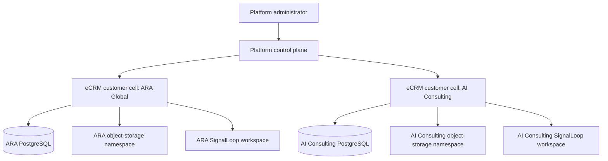

# Dedicated Customer-Cell Platform Design

**Status:** Approved design for implementation planning
**Date:** 2026-08-10
**Audience:** eCRM platform engineers, operations, and customer administrators
**Scope:** Onboard independently operated eCRM customers without allowing their business records, credentials, files, or SignalLoop activity to collide.

## 1. Decision

eCRM will use a **dedicated customer-cell** deployment model. Each customer receives a deployment of the same eCRM build with its own database, object-storage namespace, runtime secrets, and SignalLoop workspace connection. ARA Global and AI Consulting are separate cells; neither has a business-record path to the other.

A small platform control plane coordinates onboarding and lifecycle operations. It stores customer registry and deployment metadata only. It does not store or query a customer's CRM, sales, finance, production, or engagement records.

This refines the dedicated-enterprise-cell option in `docs/architecture/2026-08-09-ecrm-multitenancy-and-productization.md`. The shared build and product behavior remain common; customer-specific forks are prohibited.

## 2. Goals and non-goals

### Goals

- Physically isolate each customer's source of business records.
- Let a platform administrator provision, suspend, recover, and offboard a customer cell.
- Let each customer administrator configure their own branded workspace and approved capabilities without platform approval for routine changes.
- Connect each customer cell only to its matching SignalLoop workspace through a least-privilege credential.
- Preserve auditable recovery and support processes without granting standing cross-customer access.

### Non-goals

- A pooled database containing multiple customers' business records.
- Customer-specific source-code branches or release trains.
- A central data warehouse of raw customer CRM records.
- Allowing customer administrators to alter database, deployment, platform-security, or subscription-limit settings.

## 3. Architecture

Each cell contains:

- the standard eCRM application artifact and versioned migrations;
- one database containing only that customer's business data and cell-local users;
- a customer-specific secret set, including database, authentication, and integration secrets;
- an object-storage namespace or account that is inaccessible to other cells; and
- one matching SignalLoop workspace with a cell-specific credential.

The control plane contains a customer key, legal and display names, deployment location and URL, lifecycle state, plan/limits, provisioning history, and references to secrets. It must never contain raw leads, contacts, proposals, orders, call content, or workflow events.

## 4. Roles and authorization

| Role | Scope | Allowed actions |
|---|---|---|
| Platform administrator | Control plane and approved operational tooling | Onboard, suspend, resume, offboard, rotate a cell credential, set plan limits, and grant time-bound support access. |
| Customer administrator | Exactly one customer cell | Add/suspend local users, set local roles, configure branding/settings, enable plan-allowed modules, and configure approved integrations. |
| Customer sales representative | Exactly one customer cell | Operate the sales workspace and see only data allowed by the local role. |
| Time-bound support operator | One specified cell and time window | Diagnose a support case through audited, explicit access; no standing global customer-data access. |

Customer administrators cannot select a different customer key, workspace, database, or storage location in a request. The cell resolves its own identity from deployment configuration and secret material, not from browser input.

## 5. Platform-admin onboarding

The platform administrator creates a customer with the following input:

- legal name, display name, customer key, region, and desired subdomain;
- commercial plan, enabled-module allowance, and operational limits;
- initial customer administrator name and email; and
- optional initial branding, locale, currency, tax, and integration choices.

The control plane then performs this ordered workflow:

1. Reserve the immutable customer key and create a `PROVISIONING` registry entry.
2. Create the cell deployment, database, storage namespace, secret set, DNS/URL, and monitoring registration.
3. Apply the versioned eCRM schema and install neutral baseline configuration.
4. Create the initial local customer administrator and invitation.
5. Create or bind the matching SignalLoop workspace and issue a capability-limited integration credential.
6. Run cell health, login, backup, and isolation smoke checks.
7. Mark the cell `ACTIVE` only after all checks pass; otherwise retain evidence and mark provisioning failed.

Provisioning is idempotent by customer key. A retry must return the existing in-progress or completed cell rather than create a second database or workspace.

## 6. Customer-admin self-service

Within an active cell, customer administrators may:

- invite, suspend, and assign local users and local roles;
- set name, logo, colors, support/legal links, email/document identity, locale, currency, tax references, and local defaults;
- configure permitted pipeline stages, catalog items, sales targets, production templates, and operational settings;
- enable modules that are included in their assigned plan; and
- connect approved integrations using the cell's credential boundary.

The UI must show unavailable modules as plan-limited rather than as hidden platform functionality. Customer administrators can request a commercial plan change, but only a platform administrator changes the plan/limit record.

## 7. eCRM and SignalLoop contract

SignalLoop remains an independently deployed engagement product. For every eCRM customer cell, exactly one SignalLoop workspace is authorized through a distinct credential with explicit capabilities, expiry, rotation, and audit fields.

- eCRM exposes only that cell's allowed shared-record and workflow-event operations.
- SignalLoop authenticates with the matching cell credential; it cannot supply another customer identifier to redirect access.
- Idempotency, export keys, audit events, and retry records are cell-local.
- No SignalLoop service writes directly to an eCRM database.

If the connection is disabled, eCRM remains usable. SignalLoop activity stops at the connector boundary and is recorded as a recoverable integration condition.

## 8. Lifecycle, failure handling, and recovery

| State | Required behavior |
|---|---|
| `PROVISIONING` | No customer access until all cell checks pass. Failed steps are safe to retry. |
| `ACTIVE` | Normal cell-local operation, backups, monitoring, and credential rotation. |
| `SUSPENDED` | Deny new customer sessions and writes; retain records and audit evidence. |
| `OFFBOARDING` | Export/reconciliation and retention workflow; revoke integrations before deletion. |
| `DELETED` | Remove deployment, database, storage, and credentials only after contractual retention and an auditable approval. |

Backups, restores, and incident recovery are always scoped to one cell. A restore must never target another customer's database or storage namespace.

## 9. Security and isolation requirements

- Use separate database credentials and secrets for every customer cell.
- Use separate storage namespaces and verify ownership before every download.
- Bind integration credentials to one cell and a fixed capability set.
- Do not expose cross-cell search, reports, exports, IDs, or error details.
- Require audited, time-bound support access with customer and case references.
- Apply schema migrations with a compatibility gate across a rehearsal cell before production rollout.
- Run the same build artifact in every cell; configuration, not source changes, supplies customer branding and behavior.

## 10. Acceptance criteria

- Provision ARA Global and AI Consulting from the same build without source changes.
- Verify each has a different database, database credential, storage namespace, SignalLoop workspace, and integration credential.
- Verify an ARA user cannot read, mutate, export, attach to, search for, or infer AI Consulting records through UI, API, jobs, files, or integration calls.
- Verify each customer administrator can manage local users, branding, permitted modules, and local settings without platform approval.
- Verify a customer administrator cannot alter the cell's plan, deployment, database, storage, SignalLoop workspace binding, or platform role assignments.
- Verify failed provisioning is idempotent and leaves no orphaned active cell.
- Verify suspension immediately denies new sessions and writes for the affected cell only.
- Verify support access is time-bound and fully audited.

## 11. Delivery slices

1. Build the control-plane registry, lifecycle model, and idempotent provisioning contract.
2. Make eCRM configuration and identity cell-local; remove ARA-specific application defaults.
3. Automate database, storage, secret, URL, initial-admin, and monitoring provisioning.
4. Add customer-admin user, branding, settings, module, and integration management with plan guardrails.
5. Replace the shared integration token with a credential per cell/SignalLoop workspace.
6. Add adversarial two-cell, lifecycle, backup/restore, and support-audit tests before external onboarding.
